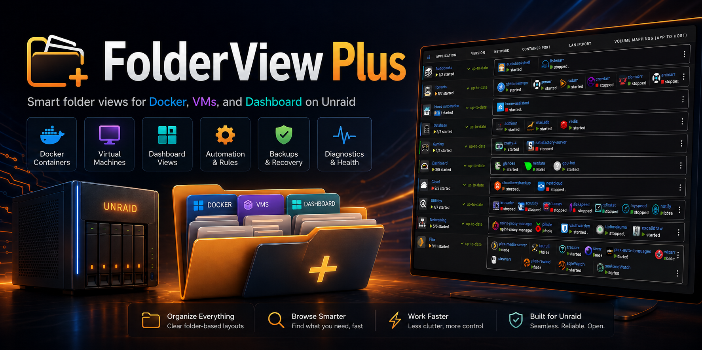
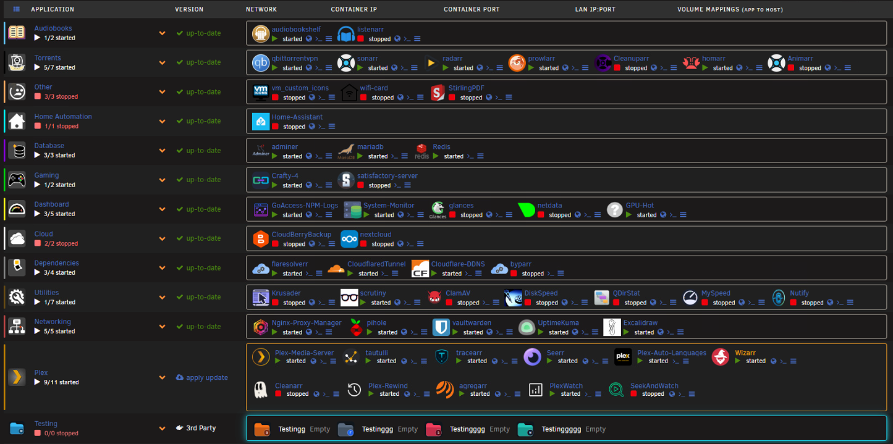
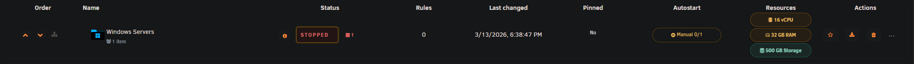
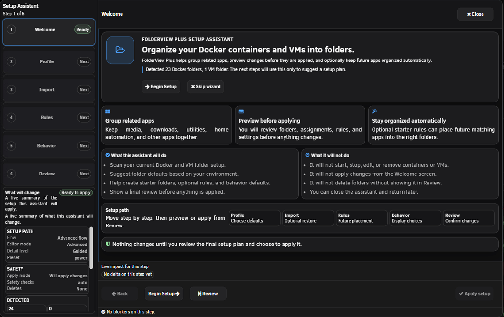
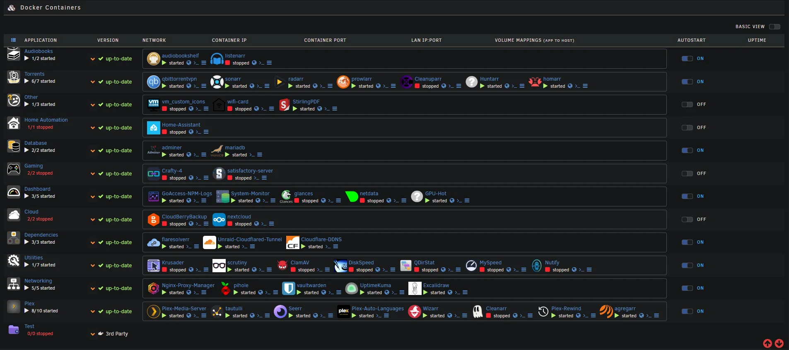

# FolderView Plus

<p align="center">
  
</p>

<p align="center">
  <a href="https://github.com/alexphillips-dev/FolderView-Plus/actions/workflows/ci.yml"></a>
  <a href="https://github.com/alexphillips-dev/FolderView-Plus/releases"></a>
  <a href="https://github.com/alexphillips-dev/FolderView-Plus/releases"></a>
  <a href="https://unraid.net/"></a>
  <a href="LICENSE.md"></a>
  <a href="https://github.com/alexphillips-dev/FolderView-Plus/issues"></a>
  <a href="https://github.com/alexphillips-dev/FolderView-Plus/commits/main"></a>
  <a href="https://buymeacoffee.com/alexphillipsdev"></a>
</p>

FolderView Plus gives Unraid a cleaner, folder-first way to manage Docker containers, VMs, and Dashboard views.
It is built for real libraries: easier organization, smarter setup, safer recovery, and clearer runtime diagnostics.

Quick links: [Install](#install) | [What It Does](#what-it-does) | [Settings Overview](#settings-overview) | [Rules Quick Guide](#rules-quick-guide) | [Bulk Assignment Quick Guide](#bulk-assignment-quick-guide) | [Backups and Recovery](#backups-and-recovery) | [Troubleshooting](#troubleshooting) | [Theme Guide](docs/THEME_GUIDE.md) | [Support Policy](SUPPORT_POLICY.md)

## Screenshots

<p align="center">
  
  
</p>
<p align="center">
  
  
</p>

## Why Install This

- Keep large Docker and VM libraries readable with folders, nested trees, and Dashboard grouping
- Use the Setup Assistant to build a starter layout quickly instead of hand-making everything
- Move from folder creation to automation, recovery, and diagnostics without leaving the plugin
- Recover safely with manual backups, scheduled backups, snapshot compare, restore, and undo
- Get real runtime and editor diagnostics when something fails instead of silent breakage

## Requirements

- Unraid `7.0.0+`
- A current major browser:
  - Chrome
  - Edge (Chromium)
  - Firefox
  - Safari

## Install

Unraid UI (`Plugins -> Install Plugin`) or CLI:

```bash
plugin install https://raw.githubusercontent.com/alexphillips-dev/FolderView-Plus/main/folderview.plus.plg
```

Dev (testing) install URL:

```bash
plugin install https://raw.githubusercontent.com/alexphillips-dev/FolderView-Plus/dev/folderview.plus.plg
```

## Update

> [!WARNING]
> If update detection is cached, use a one-time commit URL install, then return to normal `main` or `dev` updates.

- Preferred: `Plugins -> Check for Updates`
- Manual: rerun the same `plugin install` command

If update caching delays detection, install once from a commit URL:

```text
https://raw.githubusercontent.com/alexphillips-dev/FolderView-Plus/<commit>/folderview.plus.plg
```

Then return to normal branch tracking.

Version format:

- Stable: `YYYY.MM.DD.UU`
- `UU` is zero-padded for reliable Unraid ordering

## Uninstall

> [!CAUTION]
> Removing the plugin deletes its plugin-managed config directory.

```bash
plugin remove folderview.plus
```

## What It Does

### Day-to-day organization

- Folder views for Docker, VMs, and Dashboard
- Nested folders with parent/child tree support
- Manual ordering, pinned folders, and current table controls
- Folder runtime actions such as `Start`, `Stop`, `Pause`, and `Resume`
- Modern folder editor with live preview, plus a legacy editor fallback for compatibility

### Smarter setup and automation

- Setup Assistant with smart-detect starter planning
- Auto-assignment rules:
  - Docker: regex, label, image, and compose project matching
  - VMs: regex-based assignment
- Source-switched Rules workspace for Docker and VMs
- 3-step Bulk Assignment workspace for Docker and VMs
- Reusable folder templates in the Operations workspace

### Safer change management

- Pretty-printed schema exports with metadata
- Import preview with `Merge`, `Replace`, and `Skip existing`
- Manual backups, scheduled backups, snapshot compare, restore latest, and one-click undo
- Safety backup creation before restore

### Diagnostics and compatibility

- Top-of-page runtime diagnostics on Docker and VMs when folder rendering degrades or fails
- Folder editor bootstrap diagnostics with copyable output
- Settings Diagnostics with health check, suggested fixes, issue report, and support bundle export
- Safe-mode conflict handling when legacy Folder View plugins are still installed
- Legacy import and legacy CSS/JS override compatibility

## Settings Overview

FolderView Plus is split into two working modes:

- `Basic`
  - Day-to-day folder management for Docker and VMs
  - Table controls, filters, row actions, import/export, and common edits
- `Advanced`
  - `Automation`: Bulk Assignment
  - `Rules`: rule builder, ordering, testing, and conflict inspection
  - `Recovery`: backups, restore, compare, history, and undo
  - `Operations`: runtime folder actions and template library
  - `Diagnostics`: health check, recommended fixes, and support exports

Current behavior:

- Settings changes save automatically
- The page remembers whether you last used `Basic` or `Advanced`
- Rules, Recovery, and Operations remember whether you were working in Docker or VMs

## Quick Start

1. Open `Settings -> FolderView Plus`.
2. Stay in `Basic` for normal folder setup.
3. Create Docker and/or VM folders, or run the Setup Assistant if you want a starter layout.
4. Confirm the folder groups on the Docker, VM, and Dashboard pages.
5. Switch to `Advanced` only when you need automation, recovery, operations, or diagnostics.

## Rules Quick Guide

1. Open `Settings -> FolderView Plus -> Advanced -> Rules`.
2. Choose `Docker` or `VMs`.
3. Create an `Include` or `Exclude` rule:
   - target folder
   - rule kind
   - match value
4. Review rule order. Rules run from top to bottom.
5. Use:
   - `Test rule priority`
   - `Preview all assignments`
   - `Scan conflicts`
6. Changes save automatically.

## Bulk Assignment Quick Guide

1. Open `Settings -> FolderView Plus -> Advanced -> Automation`.
2. Choose the target folder.
3. Filter and select the containers or VMs you want to move.
4. Review the live plan.
5. Apply the move when the preview looks correct.

## Backups and Recovery

Recovery now lives in one source-switched workspace for Docker and VMs.

From `Settings -> FolderView Plus -> Advanced -> Recovery` you can:

- create a manual backup
- restore the latest backup
- compare two snapshots before applying a restore
- run the scheduler immediately
- set scheduled backup interval and retention
- choose one snapshot from backup history and:
  - restore it
  - download it
  - delete it
- review recent changes and undo the latest change

Recommended flow before large changes:

1. Export current config first.
2. Create a manual backup.
3. Apply the change.
4. Use restore or undo if the result is not what you wanted.

## Import, Export, and Templates

Export files:

- Docker: `FolderView Plus Export.json`
- VM: `FolderView Plus Export VM.json`
- Single folder: `<FolderName>.json`

Export format:

- Pretty-printed JSON
- Includes `schemaVersion`, `pluginVersion`, and `exportedAt`

Import flow:

1. Export current config first.
2. Import the file.
3. Review the preview diff.
4. Choose `Merge`, `Replace`, or `Skip existing`.
5. Apply only when the plan looks right.

Template workflow:

- Save a folder as a reusable template in `Advanced -> Operations`
- Reapply the template to another folder later from the same workspace

## Troubleshooting

- Settings page appears blank on a fresh install:
  - Refresh once with `Ctrl+F5`.
  - Reopen `Settings -> FolderView Plus`.
  - If it is still blank, open browser console and share the console error or a screenshot of the failure.

- Docker or VMs page shows a runtime banner:
  - Use the banner `Copy diagnostics` action.
  - The banner is there to show bootstrap, request, or host-page problems clearly.
  - Share that output if you need help.

- Folder editor opens blank or does not load the folder you clicked:
  - Copy the bootstrap diagnostics shown at the top of the editor.
  - The modern and legacy editors both expose copyable bootstrap details now.

- Folder rendering pauses with a safe-mode banner:
  - FolderView Plus auto-detects conflicting legacy Folder View runtimes.
  - Keep FolderView Plus installed.
  - Remove only the conflicting runtime plugin.
  - Refresh the Unraid UI after plugin changes.

- Using Compose Manager as well:
  - FolderView Plus now isolates its Docker runtime to avoid the old shared-page symbol collision.
  - If the Docker page still shows a runtime banner, copy diagnostics from the banner instead of guessing which plugin failed.

- Updates do not appear immediately:
  - Run `Plugins -> Check for Updates`.
  - If still cached, install once from a commit URL, then return to normal `main` or `dev` tracking.

- Import fails validation:
  - Make sure Docker exports are imported into Docker and VM exports into VMs.
  - Re-export with the latest plugin version if the file came from older tooling.

## Security and Reliability

- Request token and guarded endpoint protections
- Safer dynamic rendering to reduce XSS risk
- Runtime diagnostics instead of silent failure paths
- Automated regression checks, release guards, and raw-publish validation

## Browser Support

Supported current major browsers:

- Chrome
- Edge (Chromium)
- Firefox
- Safari (macOS and iOS)

Not supported:

- Internet Explorer 11
- Legacy Edge (EdgeHTML)

## Paths

- Config root: `/boot/config/plugins/folderview.plus`
- Custom CSS: `/boot/config/plugins/folderview.plus/styles`
- Custom JS: `/boot/config/plugins/folderview.plus/scripts`
- Third-party icons: `/usr/local/emhttp/plugins/folderview.plus/images/third-party-icons`
- User-uploaded icons: `/usr/local/emhttp/plugins/folderview.plus/images/custom`

## Theme and Customization

- Full theme guide: [docs/THEME_GUIDE.md](docs/THEME_GUIDE.md)
- Versioned theme API contract: [docs/THEME_API_CONTRACT.md](docs/THEME_API_CONTRACT.md)
- Visual/runtime contract: [docs/visual-runtime-contract.md](docs/visual-runtime-contract.md)

Runtime status colors are CSS-variable driven:

- `--fvplus-status-started`
- `--fvplus-status-paused`
- `--fvplus-status-stopped`

Legacy graph aliases remain supported:

- `--folder-view3-graph-cpu`
- `--folder-view3-graph-mem`

Canonical graph variables:

- `--fvplus-graph-cpu`
- `--fvplus-graph-mem`

## Legacy CSS/JS Migration (FolderView2/3)

FolderView Plus keeps legacy override directory support so older custom tweaks can continue working.

Supported legacy override roots:

- `/boot/config/plugins/folder.view/styles`
- `/boot/config/plugins/folder.view2/styles`
- `/boot/config/plugins/folder.view3/styles`
- `/boot/config/plugins/folder.view/scripts`
- `/boot/config/plugins/folder.view2/scripts`
- `/boot/config/plugins/folder.view3/scripts`

File naming rules:

- Docker page overrides: `*.docker.css` and `*.docker.js`
- VM page overrides: `*.vm.css` and `*.vm.js`
- Dashboard overrides: `*.dashboard.css` and `*.dashboard.js`
- Disable any override file by appending `.disabled`

Stable selector and migration policy:

- [SUPPORT_POLICY.md](SUPPORT_POLICY.md)

Recommended migration path:

1. Copy legacy overrides into `/boot/config/plugins/folderview.plus/styles` and `/boot/config/plugins/folderview.plus/scripts`.
2. Keep the same filenames where possible.
3. Hard-refresh the browser after saving (`Ctrl+F5`).

## Dev Workflow

- Generate the local runtime fixture when working on Docker or VM row layout:
  - `node scripts/generate_runtime_fixture.mjs`
- Use the deterministic finalize path for shared runtime or UI work:
  - `bash scripts/dev_finalize.sh --open-fixture`
- Build a package locally:
  - `bash pkg_build.sh`
- Prepare a release build with checks:
  - `bash scripts/release_prepare.sh`
- Run the automated test suite:
  - `node --test tests/*.mjs`

## Included Icon Pack Credits

- https://github.com/sameerasw/folder-icons
- https://github.com/hernandito/unRAID-Docker-Folder-Animated-Icons---Alternate-Colors

## Development

- Runtime source: `src/folderview.plus/`
- Manifest: `folderview.plus.plg`
- Archives: `archive/`

## Support

- Forum support thread: https://forums.unraid.net/topic/197631-plugin-folderview-plus/
- Issues: https://github.com/alexphillips-dev/FolderView-Plus/issues

## Sponsor

> [!TIP]
> If the plugin helps you, support ongoing development here:
> https://buymeacoffee.com/alexphillipsdev

## Credits

- [chodeus](https://github.com/chodeus/folder.view3) - FolderView Plus is built on the strong foundation of folder.view3.
- [sameerasw](https://github.com/sameerasw/folder-icons) and [hernandito](https://github.com/hernandito/unRAID-Docker-Folder-Animated-Icons---Alternate-Colors) - Thank you for the icon packs that improve local icon workflows.

## License

See `LICENSE.md`.
