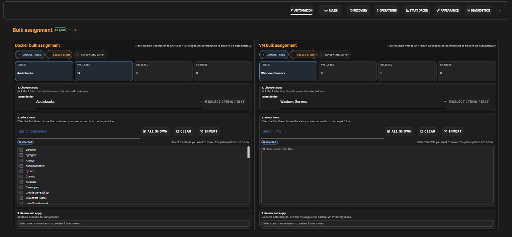
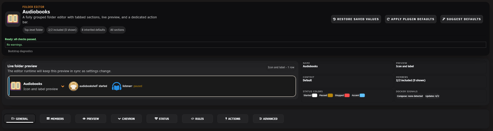
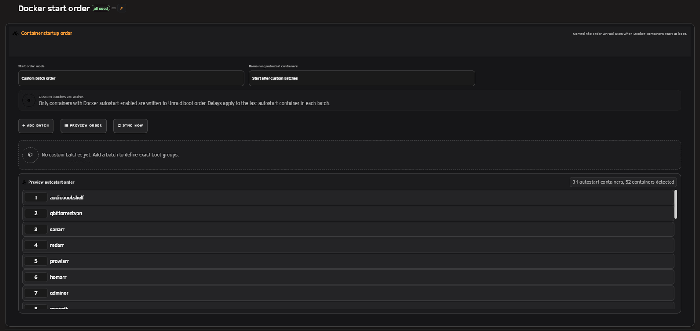
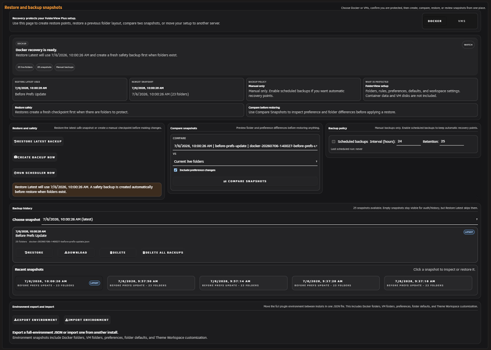
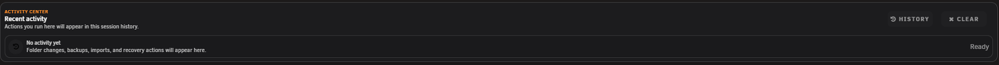
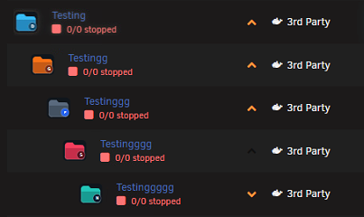
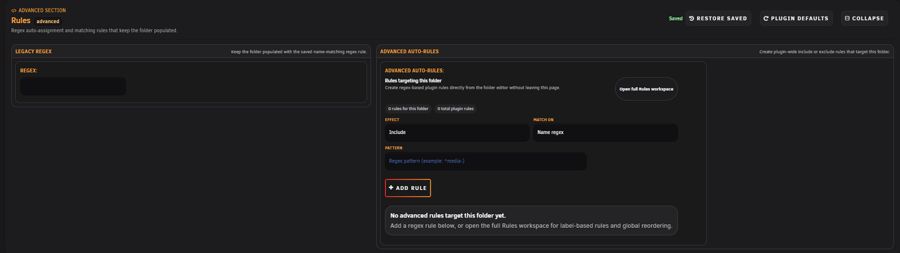
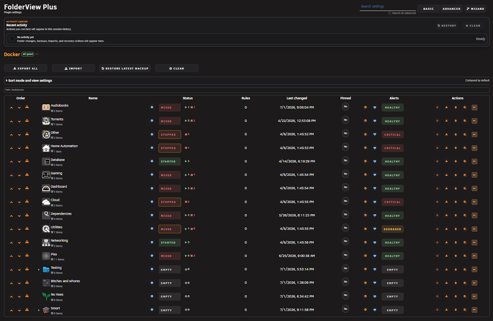

# FolderView Plus

<p align="center">
  
</p>

<p align="center">
  <a href="https://github.com/alexphillips-dev/FolderView-Plus/actions/workflows/ci.yml"></a>
  <a href="https://github.com/alexphillips-dev/FolderView-Plus/releases"></a>
  <a href="https://unraid.net/"></a>
  <a href="LICENSE.md"></a>
  <a href="https://forums.unraid.net/topic/197631-plugin-folderview-plus/"></a>
  <a href="https://buymeacoffee.com/alexphillipsdev"></a>
</p>

FolderView Plus is a folder-first organization and management plugin for Unraid. It turns large Docker, VM, and Dashboard pages into clean grouped workspaces with nested folders, live previews, folder-level actions, smart setup tools, automation rules, backups, diagnostics, and recovery options. It is built for servers that keep growing, so your Unraid UI stays readable without constantly rebuilding folder layouts by hand.

- Organize Docker containers, VMs, and Dashboard views into folders.
- Use nested folders, live previews, custom icons, and folder-level actions.
- Build starter layouts with the beginner-friendly Setup Assistant.
- Automate organization with rules, bulk assignment, templates, and Docker start order tools.
- Protect changes with backups, snapshot compare, restore, delete, and undo workflows.

Quick links: [Install](#install) | [Features](#features) | [Screenshots](#screenshots) | [Getting Started](#getting-started) | [Documentation](#documentation) | [Support](#support)

## Screenshots

| Docker folders | VM folders |
|---|---|
|  |  |

| Setup Assistant | Advanced tools |
|---|---|
|  |  |

| Folder editor | Docker start order |
|---|---|
|  |  |

| Recovery workspace | Activity Center |
|---|---|
|  |  |

## Why FolderView Plus

Unraid's Docker and VM pages can become difficult to scan as your server grows. FolderView Plus adds a structured layer on top of those pages so related apps stay together, important groups can be pinned or expanded, and common folder actions are available where you are already working. The plugin also includes setup, automation, recovery, and diagnostics tools so the folder system is easier to create, safer to change, and simpler to support.

## Features

| Folder organization | Modern folder editor |
|---|---|
| Group Docker containers, VMs, and Dashboard items into readable folders. Use nested folders, manual ordering, pinned folders, child folder previews, custom icons, and folder actions directly from runtime pages. | Edit folders through a tabbed editor with live preview, icon management, member ordering, preview controls, status colors, rules, actions, hover animations, and advanced behavior controls. |
|  |  |

| Setup Assistant | Automation and rules |
|---|---|
| Start from a guided flow that explains what FolderView Plus does, detects your environment, suggests defaults, previews the setup plan, and waits for review before applying changes. | Create ordered assignment rules for Docker and VMs, use regex and Docker metadata matching, run bulk assignment workflows, save folder templates, and review changes before applying them. |
|  |  |

| Docker start order | Backup and recovery |
|---|---|
| Control Docker autostart order from FolderView Plus. Follow your Docker page folder order or define custom startup batches with exact folder/container groups, delays, preview, and sync tools. | Create manual backups, enable scheduled backups, compare snapshots, restore the latest backup, restore a selected snapshot, delete old backups, and undo recent destructive actions. |
|  |  |

| Diagnostics and activity | Theme and UI integration |
|---|---|
| Use the Activity Center, Settings diagnostics, runtime banners, folder editor bootstrap diagnostics, and sanitized support bundles to understand what happened and share useful reports. | Uses shared dark/light theme tokens, modernized Settings and editor surfaces, runtime-safe menu styling, and compatibility guards for Unraid themes and legacy installs. |
|  |  |

## Install

Install from Unraid:

1. Open `Plugins`.
2. Choose `Install Plugin`.
3. Paste the stable plugin URL:

```bash
plugin install https://raw.githubusercontent.com/alexphillips-dev/FolderView-Plus/main/folderview.plus.plg
```

Dev testing branch:

```bash
plugin install https://raw.githubusercontent.com/alexphillips-dev/FolderView-Plus/dev/folderview.plus.plg
```

Requirements:

- Unraid `7.0.0+`
- A current major Chrome, Edge, Firefox, or Safari browser

## Getting Started

1. Open `Settings -> FolderView Plus`.
2. Run the Setup Assistant or stay in Basic mode and create folders manually.
3. Open the Docker, VM, or Dashboard pages to verify the folder layout.
4. Use the modern folder editor to tune icons, members, preview behavior, status display, and actions.
5. Move into Advanced only when you want automation, Docker start order, recovery, operations, appearance, or diagnostics.

Recommended first setup:

- Create a few top-level folders for your biggest app groups.
- Add or move members into those folders.
- Enable child folder previews if you use nested folders.
- Create a backup before large reorganizations.
- Use rules or bulk assignment once the manual layout feels right.

## Advanced Tools

| Tool | What it is for |
|---|---|
| Automation | Bulk assignment workflows for moving many Docker containers or VMs at once. |
| Rules | Ordered assignment rules with testing, matching, and conflict review. |
| Recovery | Backups, scheduled backups, snapshot history, compare, restore, delete, and undo. |
| Operations | Runtime actions, reusable templates, imports, and exports. |
| Start Order | Docker autostart order from folder order or custom startup batches. |
| Appearance | Theme and display controls for the plugin experience. |
| Diagnostics | Health checks, support reports, runtime diagnostics, and troubleshooting helpers. |

## Settings Overview

FolderView Plus keeps everyday controls in Basic mode and moves larger maintenance tools into Advanced settings. Basic settings focus on creating folders, assigning members, sorting the visible list, and using the Setup Assistant. Advanced settings add automation, ordered rules, backup and recovery, imports and exports, Docker start order, appearance controls, operations, and diagnostics.

Settings changes save automatically. Use the saved indicator, restore buttons, backups, and Activity Center to confirm what changed and recover when needed.

The diagnostics workspace includes health checks, a copyable issue report, and a v2 support bundle export preview. Sanitized support bundles redact names, paths, URLs, IPs, and user-agent values by default so reports can be shared without exposing unnecessary personal details.

Legacy CSS/JS migration and stable selector policy are documented in [docs/SUPPORT_POLICY.md](docs/SUPPORT_POLICY.md). That policy covers compatibility expectations for older folder.view migrations, stable selector/tag contracts, and the deprecation window used before removing legacy override support.

## Backups and Recovery

Use the Recovery workspace before large reorganizations, imports, rule changes, or bulk assignments. FolderView Plus can create manual backups, scheduled backups, safety snapshots before destructive actions, compare two snapshots, restore the latest safe backup, restore a selected snapshot, and delete old backups when they are no longer needed.

Empty backups are skipped by restore workflows so a blank snapshot does not replace a working folder layout. The Activity Center records backup, restore, import, export, clear, and undo activity so recent maintenance actions are easy to review.

## Troubleshooting

Start with [docs/TROUBLESHOOTING.md](docs/TROUBLESHOOTING.md) when a page does not render correctly, a folder action fails, or a setting appears out of sync. FolderView Plus includes Settings diagnostics, runtime diagnostics, Folder editor bootstrap diagnostics, support bundle preview, and copyable issue reports to make support requests easier to diagnose.

If the UI shows a diagnostics panel, copy the report text or export a sanitized support bundle before refreshing the page. Include screenshots for visual issues and mention whether the problem is on Docker, VMs, Dashboard, Settings, or the folder editor.

## Customization

Customize FolderView Plus from the folder editor and Advanced settings. You can tune folder icons, preview rows, child folder preview depth, borders, border glow, hover animations, status colors, action buttons, sort behavior, templates, rules, backups, and Docker start order.

The plugin uses shared theme tokens for modern dark and light surfaces, while still honoring compatibility guidance in the [Support Policy](docs/SUPPORT_POLICY.md) for stable selectors and legacy custom CSS/JS migration.

## Documentation

- [Docs Index](docs/README.md)
- [Troubleshooting](docs/TROUBLESHOOTING.md)
- [Theme Guide](docs/THEME_GUIDE.md)
- [Theme API Contract](docs/THEME_API_CONTRACT.md)
- [Support Policy](docs/SUPPORT_POLICY.md)
- [Visual Runtime Contract](docs/visual-runtime-contract.md)

## Support

- Forum support thread: https://forums.unraid.net/topic/197631-plugin-folderview-plus/
- GitHub issues: https://github.com/alexphillips-dev/FolderView-Plus/issues

When reporting a problem, include:

- Unraid version
- FolderView Plus version
- Browser and browser version
- Screenshot or screen recording if the issue is visual
- Diagnostics/support bundle output if the plugin shows a diagnostic panel

## Sponsor

If FolderView Plus helps your Unraid setup, you can support ongoing development here:

https://buymeacoffee.com/alexphillipsdev

## Credits

- [sameerasw](https://github.com/sameerasw/folder-icons) and [hernandito](https://github.com/hernandito/unRAID-Docker-Folder-Animated-Icons---Alternate-Colors) - Thank you for the icon packs that improve local icon workflows.

## License

See [LICENSE.md](LICENSE.md).
